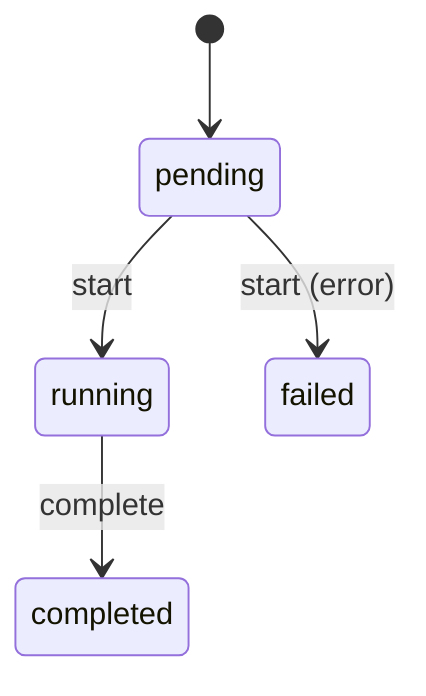

# Async Deployment

This example shows an async guard, an async transition body, and the instance-level blocking that prevents overlapping transitions while async work is still in flight.

## Mermaid



## Code

```ts
import {
  ConcurrentTransitionError,
  StateMachine,
  transition,
} from "finite-state-machine-ts";

type DeploymentState = "pending" | "running" | "completed" | "failed";

class AsyncDeployment extends StateMachine<DeploymentState> {
  capacityAvailable = true;

  static initialState = "pending" as const;

  @transition<DeploymentState, AsyncDeployment, [], Promise<string>>({
    source: "pending",
    target: "running",
    onError: "failed",
    conditions: [
      async (machine) => {
        await Promise.resolve();
        return machine.capacityAvailable;
      },
    ],
  })
  async start() {
    await Promise.resolve();
    return "started";
  }

  @transition<DeploymentState, AsyncDeployment, [], Promise<void>>({
    source: "running",
    target: "completed",
  })
  async complete() {
    await Promise.resolve();
  }
}

const deployment = new AsyncDeployment();
const pending = deployment.start();

console.log(deployment.state); // "pending"

try {
  deployment.start();
} catch (error) {
  console.error(error instanceof ConcurrentTransitionError); // true
}

await pending;
console.log(deployment.state); // "running"

await deployment.complete();
console.log(deployment.state); // "completed"
```

## How It Works

`start()` stays in `pending` while its async guard and async body are still running. Once both finish successfully, the machine commits to `running`.

Because the transition is still in flight during that window, a second call to `start()` throws `ConcurrentTransitionError` immediately. If the async guard or body fails, `onError` moves the machine to `failed`.
