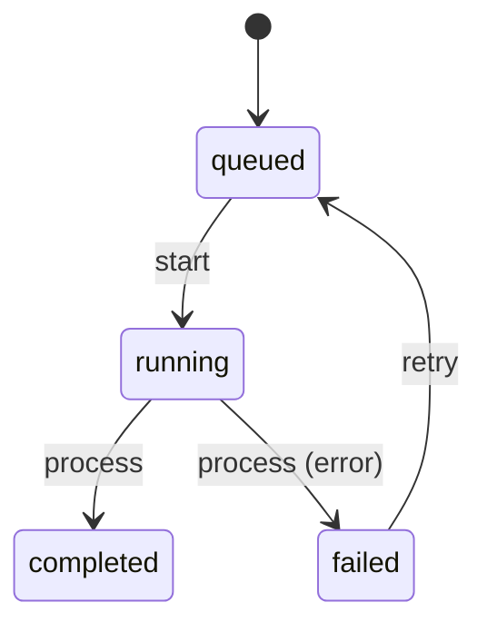

# Background Job

This example shows how `onError` creates an explicit failure edge in the diagram.

## Mermaid



## Code

```ts
import { StateMachine, transition } from "finite-state-machine-ts";

const BackgroundJobState = {
  Queued: "queued",
  Running: "running",
  Completed: "completed",
  Failed: "failed",
} as const;

type BackgroundJobState =
  (typeof BackgroundJobState)[keyof typeof BackgroundJobState];

class BackgroundJob extends StateMachine<BackgroundJobState> {
  static initialState: BackgroundJobState = BackgroundJobState.Queued;
  shouldFail = false;

  @transition<BackgroundJobState, BackgroundJob, [], void>({
    source: BackgroundJobState.Queued,
    target: BackgroundJobState.Running,
  })
  start() {}

  @transition<BackgroundJobState, BackgroundJob, [], void>({
    source: BackgroundJobState.Running,
    target: BackgroundJobState.Completed,
    onError: BackgroundJobState.Failed,
  })
  process() {
    if (this.shouldFail) {
      throw new Error("job failed");
    }
  }

  @transition<BackgroundJobState, BackgroundJob, [], void>({
    source: BackgroundJobState.Failed,
    target: BackgroundJobState.Queued,
  })
  retry() {}
}
```

## How It Works

`start()` performs the normal `queued -> running` transition. `process()` usually advances `running -> completed`, but if the method throws, the decorator catches the failure, sets `state` to `failed`, and rethrows a `TransitionExecutionError`.

That failure path is rendered as `process (error)` in the Mermaid output. `retry()` then allows a failed job to re-enter the queue.
