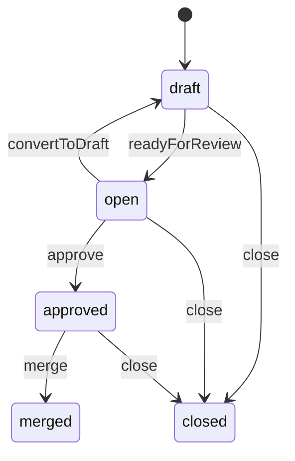

# GitHub Pull Request

This example combines multi-source transitions with a guarded merge step.

## Mermaid



## Code

```ts
import {
  StateMachine,
  transition,
  type SyncCondition,
} from "finite-state-machine-ts";

const PullRequestState = {
  Draft: "draft",
  Open: "open",
  Approved: "approved",
  Merged: "merged",
  Closed: "closed",
} as const;

type PullRequestState =
  (typeof PullRequestState)[keyof typeof PullRequestState];

const hasAtLeastOneApproval: SyncCondition<GithubPullRequest> = (machine) =>
  machine.approvals >= 1;

class GithubPullRequest extends StateMachine<PullRequestState> {
  approvals = 0;

  static initialState: PullRequestState = PullRequestState.Draft;

  @transition<PullRequestState, GithubPullRequest, [], void>({
    source: PullRequestState.Draft,
    target: PullRequestState.Open,
  })
  readyForReview() {}

  @transition<PullRequestState, GithubPullRequest, [], void>({
    source: PullRequestState.Open,
    target: PullRequestState.Draft,
  })
  convertToDraft() {}

  @transition<PullRequestState, GithubPullRequest, [], void>({
    source: PullRequestState.Open,
    target: PullRequestState.Approved,
  })
  approve() {}

  @transition<PullRequestState, GithubPullRequest, [], void>({
    source: PullRequestState.Approved,
    target: PullRequestState.Merged,
    conditions: [hasAtLeastOneApproval],
  })
  merge() {}

  @transition<PullRequestState, GithubPullRequest, [], void>({
    source: [
      PullRequestState.Draft,
      PullRequestState.Open,
      PullRequestState.Approved,
    ],
    target: PullRequestState.Closed,
  })
  close() {}
}
```

## How It Works

The review flow is linear until merge: `draft -> open -> approved -> merged`. `merge()` is guarded by `hasAtLeastOneApproval`, so the transition only succeeds when the machine has recorded at least one approval.

`close()` accepts three different source states, which is why the diagram has three separate edges into `closed`. Once the PR is `merged` or `closed`, no additional transitions are defined.
