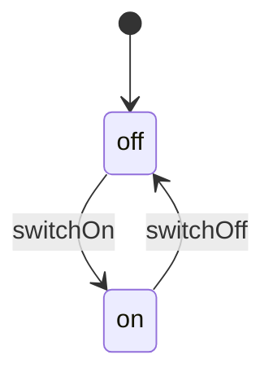

# Light Switch

This example shows a guarded transition using a condition function.

## Mermaid



## Code

```ts
import {
  StateMachine,
  transition,
  type SyncCondition,
} from "finite-state-machine-ts";

type LightState = "off" | "on";

const isPowered: SyncCondition<LightSwitch> = (machine) => machine.hasPower;

class LightSwitch extends StateMachine<LightState> {
  hasPower = true;

  static initialState = "off" as const;

  @transition<LightState, LightSwitch, [], void>({
    source: "off",
    target: "on",
    conditions: [isPowered],
  })
  switchOn() {}

  @transition<LightState, LightSwitch, [], void>({
    source: "on",
    target: "off",
  })
  switchOff() {}
}
```

## How It Works

`switchOn()` can only run from `off`, and it also requires `isPowered(machine)` to return `true`. If the condition fails, the library throws `TransitionConditionFailedError` and leaves the state unchanged.

`switchOff()` is the plain inverse transition. Together, the two methods form the `off <-> on` cycle in the diagram.
