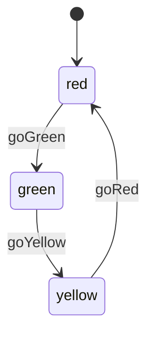

# Traffic Light

This example models a fixed cycle where each state has exactly one valid next state.

## Mermaid



## Code

```ts
import { StateMachine, transition } from "finite-state-machine-ts";

type TrafficLightState = "red" | "green" | "yellow";

class TrafficLight extends StateMachine<TrafficLightState> {
  constructor(initialState: TrafficLightState = "red") {
    super(initialState);
  }

  @transition<TrafficLightState, TrafficLight, [], void>({
    source: "red",
    target: "green",
  })
  goGreen() {}

  @transition<TrafficLightState, TrafficLight, [], void>({
    source: "green",
    target: "yellow",
  })
  goYellow() {}

  @transition<TrafficLightState, TrafficLight, [], void>({
    source: "yellow",
    target: "red",
  })
  goRed() {}
}
```

## How It Works

Each method encodes exactly one edge in the cycle. There are no conditions and no error targets, so the machine only changes state when the current state matches the method's configured `source`.

Trying to skip the cycle, such as calling `goRed()` while already in `red`, throws an `InvalidSourceStateError`.
