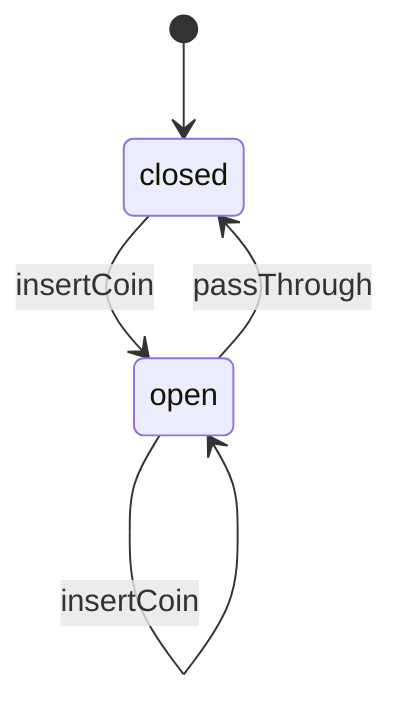

# Turnstile

This is the smallest example in the repo: one self-looping transition and one transition back to the starting state.

## Mermaid



## Code

```ts
import { StateMachine, transition } from "finite-state-machine-ts";

type TurnstileState = "closed" | "open";

class Turnstile extends StateMachine<TurnstileState> {
  static initialState: TurnstileState = "closed";

  @transition<TurnstileState, Turnstile, [], void>({
    source: ["closed", "open"],
    target: "open",
  })
  insertCoin() {}

  @transition<TurnstileState, Turnstile, [], void>({
    source: "open",
    target: "closed",
  })
  passThrough() {}
}
```

## How It Works

`insertCoin()` accepts two source states. From `closed` it opens the gate, and from `open` it leaves the gate open, which is why the diagram shows a self-loop on `open`.

`passThrough()` only allows the `open -> closed` transition. Calling it while the machine is `closed` raises an `InvalidSourceStateError` and does not mutate the state.
